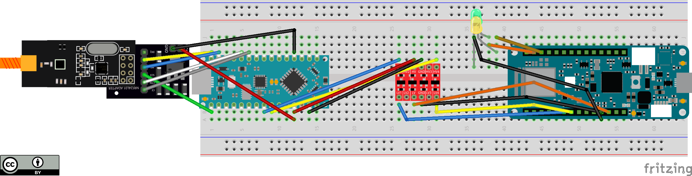
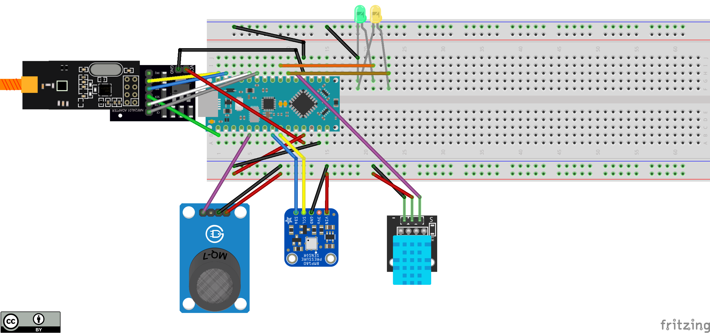

# Hardware docs

## Schematics
- Base \
  \
  [File fritzing](files/base_radio.fzz)
- Box \
  \
  [File fritzing](files/fly_radio.fzz)
- Old \
  [Board1](files/board1.fzz)\
  [Board2](files/board2.fzz)

## Datasheet e risorse

### Board and MCU
- Arduino MKR WiFi 1010
  - [Datasheet](files/Arduino%C2%AE%20MKR%20WiFi%201010-datasheet.pdf)
  - [Pinout](files/Arduino%C2%AE%20MKR%20WiFi%201010-full-pinout.pdf)

- Arduino Nano Every
  - [Datasheet](files/Arduino%C2%AE%20Nano%20Every-datasheet.pdf)
  - [Pinout](files/Arduino%C2%AE%20Nano%20Every-full-pinout.pdf)

- Arduino Mega 2560 Rev3
  - [Datasheet](https://docs.arduino.cc/static/9811af9d2ce5591131a06f1a0ab46a75/A000067-datasheet.pdf)
  - [Pinout](https://docs.arduino.cc/static/edb006e0a180e80b9ea9cf8b4859dcd4/A000067-full-pinout.pdf) 

- Arduino UNO R3
  - [Datasheet](https://docs.arduino.cc/static/74eecca06899bd1a9753e657a2e3905d/A000066-datasheet.pdf)
  - [Pinout](https://docs.arduino.cc/static/c57a658e0f7afad334f6f73e82dfd83d/A000066-full-pinout.pdf)

- ESP-32
  - [AZ-Delivery Dev Kit](files/ESP-32%20Dev%20Kit%20C%20V2_ITA.pdf)

### Sensori
- BMP180
  - Sensore di pressione
  - [Datasheet](https://cdn-shop.adafruit.com/datasheets/BST-BMP180-DS000-09.pdf)
  - [Sparkfun docs and lib](https://github.com/sparkfun/BMP180_Breakout_Arduino_Library)

- DHT11
  - Sensore di temperatura e umidità
  - [Datasheet](https://components101.com/sites/default/files/component_datasheet/DHT11-Temperature-Sensor.pdf)
  - [3 pin versione](https://components101.com/sensors/dht11-temperature-sensor)
  - [Arduino DHT library](https://github.com/adafruit/DHT-sensor-library)

- MQ7
  - Sensore di monossido di carbonio
  - [Datasheet](https://www.sparkfun.com/datasheets/Sensors/Biometric/MQ-7.pdf)
  - [Sensor info and arduino library](https://github.com/fjebaker/MQ7)

- MQ131 Low Concentration
  - Sensore di ozono
  - [Datasheet](files/MQ131-low-concentration.pdf)
  - [Arduino driver](https://github.com/ostaquet/Arduino-MQ131-driver)

[Local files](files)